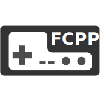

<div align="center">
  
</div>

# FCPP
FCPP是一个使用C++实现的，跨平台的、简单而精确的FC/NES模拟器。
FCPP是我的本科毕业设计，但我希望不止于此，而是继续做得更好。

FCPP可以编译为WebAssembly，[在浏览器中尝试!](https://tianzerl.github.io/FCPP_WASM_DEMO/)

# 截图


# 默认按键映射
| NES手柄 | 键盘  | Xbox360手柄 |
| ------- | ----- | ----------- |
| A       | A     | A           |
| B       | S     | B           |
| Select  | X     | X           |
| Start   | Z     | Start       |
| Up      | Up    | Up          |
| Down    | Down  | Down        |
| Left    | Left  | Left        |
| Right   | Right | Right       |
| Turbo A | Q     | LB          |
| Turbo B | W     | RB          |

# 快捷键
| 按键 | 功能      | QFCPP支持 | TFCPP支持 |
| ---- | --------- | --------- | --------- |
| F1   | 快速存档  | 是        | 是        |
| F2   | 快速读档  | 是        | 是        |
| F3   | 重置      | 是        | 是        |
| F4   | 暂停\恢复 | 是        | 是        |
| F5   | 倒带      | 是        | 否        |

# 编译
## 第三方库
- SDL2（可选，作为多媒体后端）
- SFML2（可选，作为多媒体后端）
- raylib（可选，作为多媒体后端，可由CMake自动下载）
- Qt5或者Qt6（可选，用于编译GUI）
- Pybind11（可选，用于编译Python绑定，可由CMake自动下载）
## 编译工具
- CMake（v3.13及以上）
- 支持C++17的编译器
## CMake选项
| 选项                      | 描述                 | 默认值 |
| ------------------------- | -------------------- | ------ |
| FCPP_SHARED_LIB           | 编译为动态库         | OFF    |
| FCPP_IO_WITH_SFML2        | 编译SFML2后端        | OFF    |
| FCPP_IO_WITH_SDL2         | 编译SDL2后端         | ON     |
| FCPP_IO_WITH_RAYLIB       | 编译raylib后端       | OFF    |
| FCPP_BUILD_CLI            | 编译CLI              | ON     |
| FCPP_BUILD_GUI            | 编译GUI              | ON     |
| FCPP_BUILD_TEST_CORE      | 编译libfcpp测试程序  | OFF    |
| FCPP_BUILD_TEST_WASM      | 编译WASM测试demo     | OFF    |
| FCPP_BUILD_TEST_DEBUGGER  | 编译Debugger测试demo | OFF    |
| FCPP_BUILD_C_BINDING      | 编译C语言绑定        | OFF    |
| FCPP_BUILD_PYTHON_BINDING | 编译Python绑定       | OFF    |
| FCPP_BUILD_WASM           | 编译wasm相关库       | OFF    |
| FCPP_LTO                  | 开启链接时优化       | OFF    |
## 构建示例
### Windows（MSVC）
1. 根据需要调整CMake选项，并使用CMake生成Visual Studio项目。
2. 若无特殊需求，调整构建模式为release。
3. 生成`ALL_BUILD`项目。
4. （可选）生成`INSTALL`项目，安装二进制文件到指定位置。
### Linux（GCC或者Clang）
以KUbuntu21.10使用Qt5编译默认CMake配置为例：

```shell
# 安装Qt5和SDL2
sudo apt-get install qtbase5-dev qtbase5-dev-tools libsdl2-dev
# 进入FCPP根目录，准备构建
cd FCPP && mkdir build && cd build
# 执行cmake
cmake ..
# 构建
make
# 执行二进制文件
./bin/qfcpp
# 安装（可选）
make install
```
### WASM (Emscripten)
使用Emscripten编译不需要额外依赖项，下载emsdk编译即可
```shell
# 进入FCPP根目录，准备构建
cd FCPP && mkdir build_wasm && cd build_wasm
# 执行cmake
emcmake cmake .. -DFCPP_EMSCRIPTEN_PRESET=ON -DROM_PATH="/rom/文件/路径"
# 构建
emmake make
# 开启一个http服务器以在浏览器上运行
emrun ./bin/fcpp_test_wasm.html
```
### Mac
未测试，理论可行，和Linux类似

# Mapper支持
- Mapper 0
- Mapper 1
- Mapper 2
- Mapper 3
- Mapper 4
- Mapper 7
- Mapper 9
- Mapper 10
- Mapper 11
- Mapper 13
- Mapper 92
- Mapper 180

Mapper与游戏的对应关系可参考[此处](http://tuxnes.sourceforge.net/nesmapper.txt).

# 测试ROM
- [NovaTheSquirrel](https://github.com/NovaSquirrel/NovaTheSquirrel)
- [nes-test-roms](https://github.com/christopherpow/nes-test-roms)
