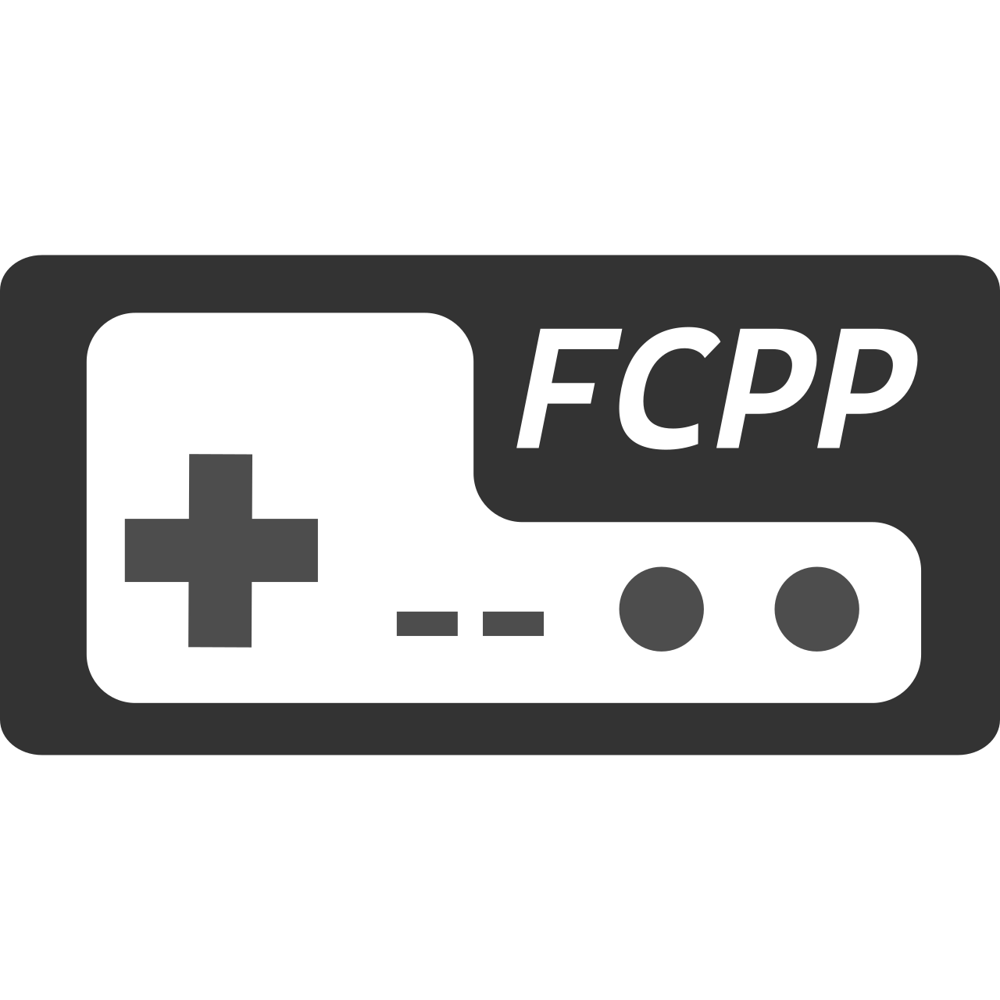

<div align="center">
  
</div>

# FCPP
FCPP是一个使用C++实现的，简单，精确的FC/NES模拟器。FCPP是我的本科毕业设计，但我希望不止于此，将她继续做得更好。

# 截图


# 默认按键映射
| NES手柄 | 键盘  | Xbox360手柄 |
| ------- | ----- | ----------- |
| A       | A     | A           |
| B       | S     | B           |
| Select  | X     | X           |
| Start   | Z     | Start       |
| Up      | Up    | Up          |
| Down    | Down  | Down        |
| Left    | Left  | Left        |
| Right   | Right | Right       |
| Turbo A | Q     | LB          |
| Turbo B | W     | RB          |

# 快捷键
| 按键 | 功能      | QFCPP支持 | TFCPP支持 |
| ---- | --------- | --------- | --------- |
| F1   | 快速存档  | 是        | 是        |
| F2   | 快速读档  | 是        | 是        |
| F3   | 重置      | 是        | 是        |
| F4   | 暂停\恢复 | 是        | 是        |
| F5   | 倒带      | 是        | 否        |

# 编译
## 第三方库
- SDL2（可选，作为多媒体后端）
- SFML2（可选，作为多媒体后端）
- raylib（可选，作为多媒体后端，可在编译时自动下载）
- Qt5或者Qt6（可选，用于编译GUI）
- Pybind11（可选，用于编译Python绑定，可在编译时自动下载）
## 编译工具
- CMake（v3.12及以上）
- 支持C++17的编译器（至少需要支持“Nested namespace definition”特性，若需要编译TFCPP (CLI)，则还需要“init-statements for if and switch”支持，编译器是否支持这些特性可参考[此处](https://en.cppreference.com/w/cpp/compiler_support)）
## CMake选项
| 选项                      | 描述                   | 默认值 |
| ------------------------- | ---------------------- | ------ |
| FCPP_CORE_SHARED_LIB      | 编译libfcpp为动态库    | OFF    |
| FCPP_IO_SHARED_LIB        | 编译libfcpp_io为动态库 | OFF    |
| FCPP_IO_WITH_SFML2        | 编译SFML2后端          | OFF    |
| FCPP_IO_WITH_SDL2         | 编译SDL2后端           | ON     |
| FCPP_IO_WITH_RAYLIB       | 编译raylib后端         | OFF    |
| FCPP_BUILD_CLI            | 编译CLI                | ON     |
| FCPP_BUILD_GUI            | 编译GUI                | ON     |
| FCPP_BUILD_TEST           | 编译测试程序           | OFF    |
| FCPP_BUILD_C_BINDING      | 编译C语言绑定          | OFF    |
| FCPP_BUILD_PYTHON_BINDING | 编译Python绑定         | OFF    |
| FCPP_LTO                  | 开启链接时优化         | OFF    |
## 构建示例
### Windows（MSVC）
1. 根据需要调整CMake选项，并使用CMake生成Visual Studio项目。
2. 若无特殊需求，调整构建模式为release。
3. 生成`ALL_BUILD`项目。
4. （可选）生成`INSTALL`项目，安装二进制文件到指定位置。
### Linux（GCC或者Clang）
以KUbuntu21.10使用Qt5编译默认CMake配置为例：

```shell
#安装Qt5和SDL2
sudo apt-get install qtbase5-dev qtbase5-dev-tools libsdl2-dev
#进入FCPP根目录，准备构建
cd FCPP && mkdir build && cd build
#执行cmake
cmake ..
#构建
make -j8
#执行二进制文件
./bin/qfcpp
#安装（可选）
make install
```
### Mac
未测试，理论可行，和Linux类似

# Mapper支持
- Mapper 0
- Mapper 1
- Mapper 2
- Mapper 3
- Mapper 4
- Mapper 7
- Mapper 9
- Mapper 10
- Mapper 11
- Mapper 13
- Mapper 92
- Mapper 180

Mapper与游戏的对应关系可参考[此处](http://tuxnes.sourceforge.net/nesmapper.txt).

# 测试ROM
- [NovaTheSquirrel](https://github.com/NovaSquirrel/NovaTheSquirrel)
- [nes-test-roms](https://github.com/christopherpow/nes-test-roms)
